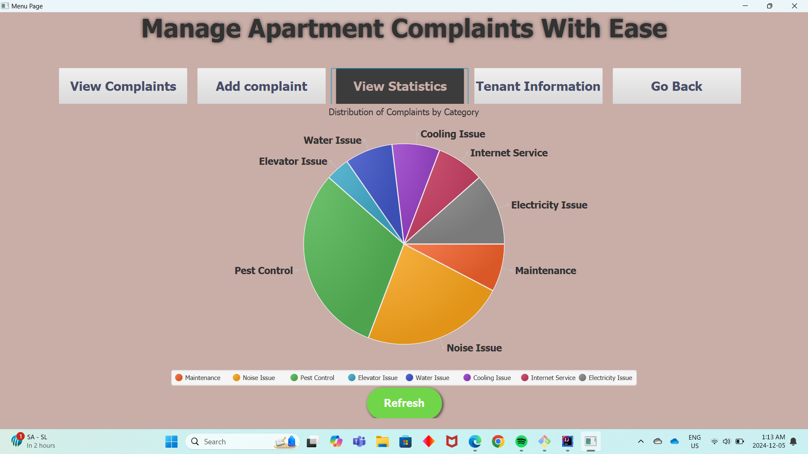

# Apartment Complaint Management System (ACMS)

## Overview 

The Apartment Complaint Management System (ACMS) is a user-friendly desktop application designed to help apartment managers streamline the process of handling tenant complaints. By simplifying the logging, tracking, and resolution of complaints, this system ensures efficient management and improved tenant satisfaction.

## Prerequisites

To make this Application work, you need to meet below requirements:

- **IntelliJ IDEA** to work with the project. Download it from [here](https://www.jetbrains.com/idea/).
- **Gradle** (version 20). You can install it directly from Intellij.
- **JDBC Driver**: Ensure you have the appropriate JDBC driver for the database you're using like MySQL.
- **Database**: You must have access to a running database. Ensure the JDBC connection details (URL, username, password,server name) are correctly configured in your project.

## Installation

1.Clone the repository to your local machine by using below command in terminal:

`git clone https://github.com/Sakshi2336/Java3_ComplaintManagament_Project.git`

2.Then write these commands in your terminal:

`git checkout development`

`git pull`

3.Then open your project into **Intellij IDEA**

4.Now Gradle will automatically download dependencies including JDBC driver.

## How to run the application

You need to run **LoginForm.java** class and once you will enter your username,password,database name and server name, you are all set to use this application.

## Features

1. **Login Page**

- This is the Login Page where you will need to enter your username, password of your database then database name where you want to create all tables related to this application and then server name.
- Once you do this and hit **Test Connection** button, you will see Welcome page of the application.

2. **Welcome Page**

- This is the entry point of this application.

3. **Main Dashboard**

    1. **View All Complaints**

        

        - In View Complaints tab you can see all registered complaints till now.
        - You can have every details related to any complaint including
            + Short description
            + Submit time
            + Complaint status - Open , In Process , Resolved
            + Tenant who registered that complaint
            + Flat number 
            + Assigned Manager
    
    2. **Update Form**

       
   
       - By clicking on any complaint you can see update form where you can change complaint description , complaint status and assigned manager.

    3. **Add Complaint Form**

       

        - In Add complaint form, you can easily add more complaints.

    4. **Statistics**

       

       - In this tab, we have pie chart showing complaints distribution by each category.

    5. **Tenant Information**

       

       - Here you can have list of tenants, living in the apartment with associated flat.
       - By clicking Remove button after selecting any tenant from list, you can easily delete tenant record from tables after tenant moved out.

    6. **Go Back**

       -  Go Back tab will take you back to the Welcome page.
       

## Database Schema

